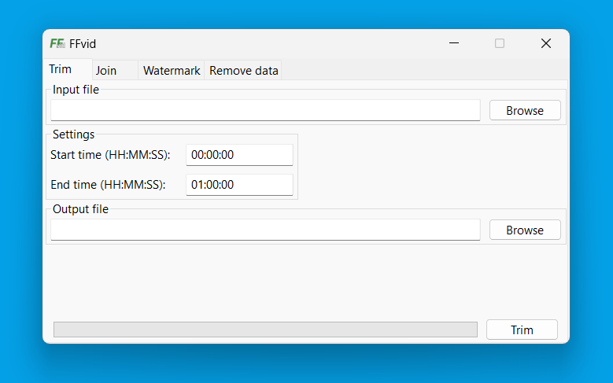
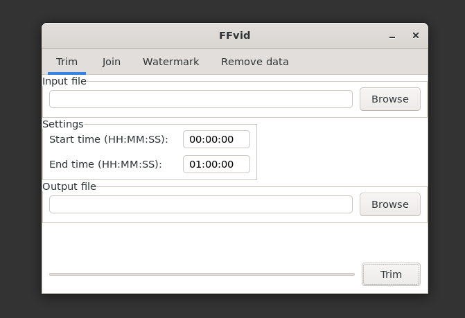

<h1 align="center">FFvid</h1>

> Fast and easy-to-use video editor based on [FFmpeg](https://ffmpeg.org). Cross-platform, native GUI allows you to get the performance of pure FFmpeg without having to remember commands.

## ⚡ Fast
No re-encoding where possible is the fastest possible option for editing videos.

## 🖥️ Native feel
Using the C++ language and the multi-platform wxWidgets library generates a fast and clean application that launches in the blink of an eye.
| Windows 11 | GTK 3 |
|---|---|
|  |  |

## ✨ Functions
`FFvid` currently offers:
- video trimming
- joining multiple videos into one
- adding a watermark to a video

## 🚀 How to install

### Compile from source
You will need [CMake](https://cmake.org) and [wxWidgets](https://www.wxwidgets.org) installed. On systems other than Windows, the [fmt](https://fmt.dev) library is also needed. To build the project in debug configuration use:
```
cmake -S. -Bbuild
cmake --build build
```
or if you want to build in release configuration:
```
cmake -S. -Bbuild
cmake --build build --config Release
```
The main executable can be found in the `build/out/(Debug or Release)` directory.
